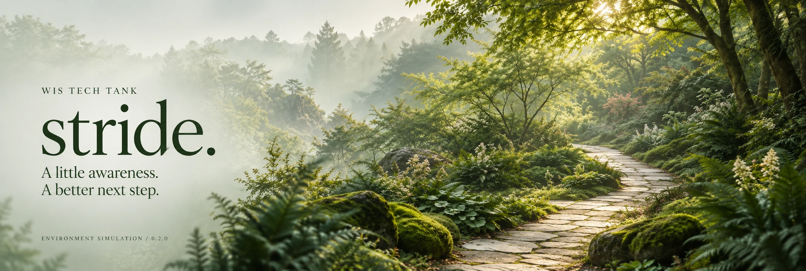
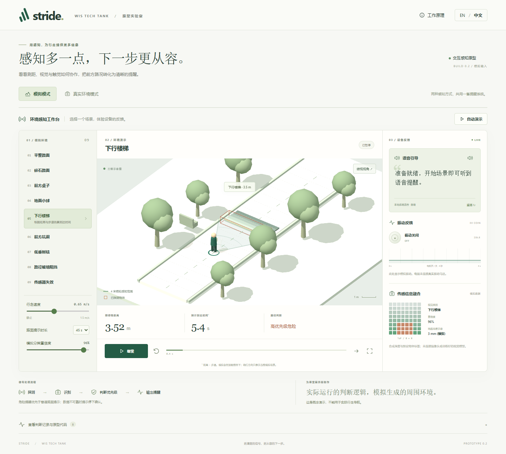

<p align="center">WIS TECH TANK &nbsp; / &nbsp; CLASSROOM FIELD NOTES &nbsp; / &nbsp; 0.2.0</p>

<h1 align="center">STRIDE<span>．</span></h1>
<p align="center"><i>A little awareness. A better next step.</i></p>

<a href="https://chefzc-wis-tech-tank.vercel.app"></a>

<p align="center"><b>English</b> · <a href="README.zh-CN.md">简体中文</a></p>
<p align="center"><a href="https://chefzc-wis-tech-tank.vercel.app"><b>OPEN THE LAB ↗</b></a> &nbsp; / &nbsp; <a href="https://chefzc-homepage.vercel.app/school-gallery.html">THE EXHIBITION</a> &nbsp; / &nbsp; <a href="https://chefzc-homepage.vercel.app/post.html?article=wis-tech-tank">FIELD NOTES</a></p>

## 01 / A small world, made understandable

**STRIDE** is an environmental perception and assistive-walking concept built for a **WIS TECH TANK school presentation**. Choose a scene, start walking in a simulated world, and watch distance, risk, speech and haptic patterns respond together. Forest green, sage and warm paper keep the interface quiet enough to notice the important details.

The main experience needs **no camera or sign-in**. The Chinese / English switch translates the interface and guidance. Everything runs in the browser.

| Explore | What happens |
| :--- | :--- |
| **Nine environments** | Smooth pavement, uneven ground, a table, a small ball, downward stairs, a pothole, a branch, a blocked route and sensor uncertainty. |
| **A world you can adjust** | Walking speed, simulated classification confidence, 10 / 45 / 60-second terrain feedback and two camera angles. Start, pause, reset or run the guided demo. |
| **Feedback you can follow** | On-screen speech, optional browser speech synthesis, animated motor pulses, an on/off waveform and a schematic 8 × 8 sensor grid. |
| **Decisions you can inspect** | Priority handling, pre-contact stopping, uncertainty responses, a readable event log and a JSON export. |


<p align="center"><sub>FIELD PLATE 01 / Actual application capture. The scene and sensor readings are simulated.</sub></p>

## 02 / A second window on the environment

The optional **Real environment** mode uses a camera or an uploaded image. COCO-SSD detects objects, SegFormer proposes structural regions, and optional Depth Anything V2 adds relative proximity. A camera-relative 2D view shows observations and unknown space; tracks retain IDs across frames and expire when lost. Static uploads are explicitly labelled as non-live.

Model files are served from this app's own origin. Inference runs locally; camera frames are not uploaded, recorded or saved. The manual event export contains metadata, not images. Real mode asks for camera permission only when you start the camera; simulation never needs it. The first model load is substantial, so use a modern desktop browser and allow loading to finish.

**This is a classroom prototype, not a real-world navigation aid.** Simulated metres are scripted measurements. Real-mode proximity is uncalibrated and relative, not a ToF measurement or metric depth. The local map is not SLAM or a panoramic reconstruction. No detection does not establish a clear path. There is no connected physical motor or sensor. Read the [verification boundaries](VERIFICATION.md) before a demonstration.

## 03 / Open your own lab

Node.js **22.23.1 or later in the 22.x line** is recommended. Model weights, pinned source revisions, checksums and licence notices are included in the source repository; generated bundles and the optional Windows runtime are not.

```sh
git clone https://github.com/ChefDavid0815/wis-tech-tank.git
cd wis-tech-tank
npm ci
npm run build
npm test
npm start
```

Open `http://127.0.0.1:4173`. Building also produces `打开演示.html`, a self-contained **simulation-only** page you can open directly. The camera and local models need the server or the HTTPS web edition. For development, run `npm run dev` after building once.

`scripts/prepare-models.mjs` restores model assets if needed. `public/models/*/SOURCE.json` pins the two Hugging Face model revisions and `public/models/manifest.json` records hashes. Vercel uses `vercel.json`: `npm ci` → `npm run build` → `dist`, with no server functions or secrets required.

| Inside the project | Responsibility |
| :--- | :--- |
| `src/engine.ts` · `src/scene.ts` | Simulation rules and the Three.js environment |
| `src/environment.ts` · `src/live-view.ts` | Object tracks, risk and camera-relative map |
| `src/perception.ts` · `src/perception-worker.ts` | Local object, layout and relative-depth models |
| `src/outputs.ts` · `src/main.ts` | Speech, controls and bilingual presentation |
| `tests/engine.test.ts` | Fourteen core behaviour tests |

## 04 / Notes from the workbench

- [Chinese classroom guide](docs/CLASSROOM-GUIDE.zh-CN.md) · [presentation script](演示讲稿.md)
- [Verification report](VERIFICATION.md) · [third-party components and licences](THIRD-PARTY.md)
- [Changelog](CHANGELOG.md) · [artwork provenance](docs/ARTWORK.md)

Original source is shared for inspection; no blanket licence is granted over third-party models or artwork. Each dependency and model keeps its own licence. In particular, the SegFormer weights have non-commercial research/evaluation terms; this educational prototype is not a commercial product.

<p align="center">SENSE &nbsp; → &nbsp; UNDERSTAND &nbsp; → &nbsp; PRIORITIZE &nbsp; → &nbsp; GUIDE</p>
<p align="center"><sub>Made by ChefZC · For a little more curiosity, and a clearer next step.</sub></p>
